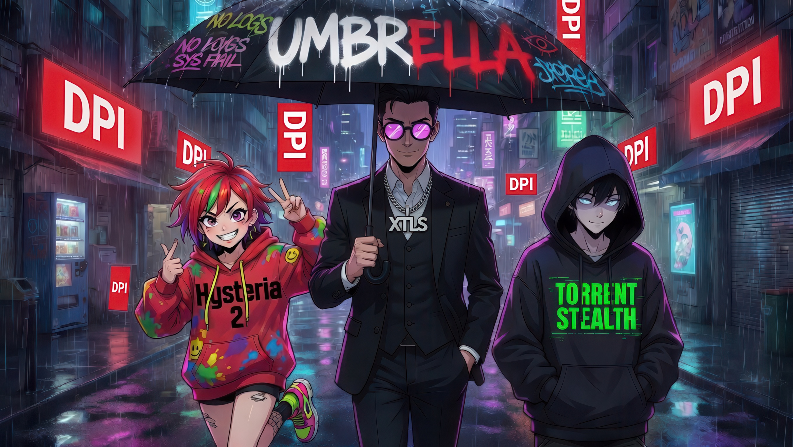
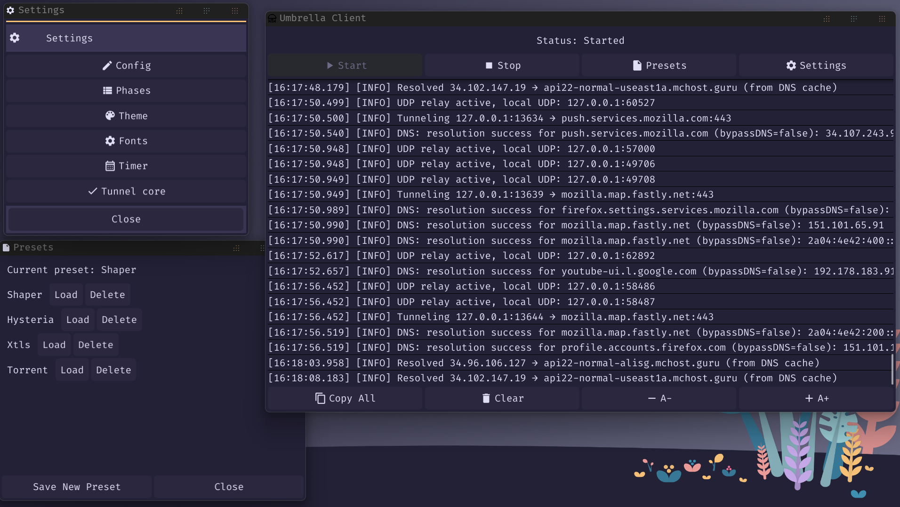

# Umbrella Protocol

Комплексное решение для обхода цензуры, объединяющее три различных стратегии маскировки трафика в одном приложении.

---

---

## Три стратегии Umbrella

Проект реализует три протокола, каждый из которых оптимизирован под свои задачи и имеет кастомные надстройки (см. подробнее в .md):

### 1. 🏎️ Hysteria 2 (Гоночный болид)
**Идеально для:** Максимальной скорости, 4K-стриминга и гейминга на плохих линиях.
*   **База:** QUIC (UDP) с BBR.
*   **Маскировка:** Рандомный паддинг на уровне протокола + маскарад под HTTPS.
*   **Особенности:** Пробивает задержки и потери пакетов там, где другие сдаются.
*   [Подробнее в hysteria.md](./docs/protocols/hysteria.md)

### 2. 🚗 XTLS Reality + Vision (Бизнес-седан)
**Идеально для:** Ежедневного серфинга с идеальной мимикрией под обычный сайт.
*   **База:** TCP (TLS 1.3).
*   **Маскировка:** Кража личности (Reality) легитимного сайта + "тонировка" Vision для скрытия TLS-in-TLS сигнатур.
*   **Особенности:** Практически неотличим от визита на Google/Microsoft. Самый сбалансированный выбор.
*   [Подробнее в xtls.md](./docs/protocols/xtls.md)

### 3. 🚚 Torrent Stealth (Грузовик-невидимка)
**Идеально для:** Максимальной выживаемости в условиях жестких блокировок.
*   **База:** uTP (UDP) поверх Piece-фрейминга BitTorrent.
*   **Маскировка:** Поведенческая имитация торрент-клиента + White Noise (запросы к трекерам) + Рандомный паддинг.
*   **Особенности:** Почти невозможно заблокировать, не сломав легитимный BitTorrent-трафик в стране.
*   [Подробнее в torrent.md](./docs/protocols/torrent.md)

---

## Общие технологии защиты (для всех протоколов)

### Shaper
Динамическое изменение формы трафика. Позволяет имитировать паттерны загрузки страниц, API-вызовов или просто ограничивать скорость (Limiter), чтобы не привлекать внимание аномальными всплесками.

[Подробнее в shaper.md](./docs/shaper.md)

### Global Decoy Traffic
Decoy-модуль работает на уровне приложения:
*   Генерирует редкие (раз в 1-5 минут) прямые `HEAD` запросы к популярным ресурсам (Bing, Yahoo, Apple, Intel и др.).
*   Размывает статистику IP-соединений в глазах провайдера: ваш IP общается не только с VPS, но и с десятком легитимных мировых сервисов.
*   Минимальный расход трафика без потери скрытности.

---

## Umbrella Server

Сервер поддерживает все три режима. Конфигурация гибко настраивается под выбранную стратегию защиты. 

[Подробности настройки сервера в setup_guide.md](./docs/setup_guide.md)

---

## Umbrella Client (Fyne UI)

Современный графический интерфейс, предоставляющий полный контроль над туннелем и системными настройками.

### Основные возможности и окна:
- **Главный экран**: 
  - Большая кнопка **Start/Stop** для мгновенного управления.
  - Виртуализированный лог (widget.List) с поддержкой копирования строк по клику.
  - Индикаторы статуса и текущего режима.
  - Быстрое управление размером шрифта логов.
- **Окно настроек**:
  - **Config Editor**: Встроенный редактор `config.yaml` (проверка структуры перед сохранением).
  - **Phase Editor**: Настройка поведения Shaper'а через редактор фаз.
  - **Presets**: Система сохранения и мгновенного переключения между профилями настроек.
  - **Tunnel Core**: Интеграция со сторонними инструментами (Mihomo, sing-box, ProxiFyre).
- **Персонализация**:
  - **Themes**: Выбор из нескольких предустановленных тем оформления.
  - **Fonts**: Возможность установки кастомных шрифтов (.ttf/.otf) для всего интерфейса.
- **Инструменты**:
  - **Timer**: Автоматическое выключение туннеля по расписанию.

---

## Советы по маскировке

### Для XTLS
- Используйте в качестве `sni` и `dest` сайты, которые не заблокированы в вашем регионе, но находятся за пределами страны (например, `samsung.com`, `intel.com`).
- Включите `decoy-traffic` для размытия статистики.

### Для Torrent
- Укажите в `info-hash` хеш популярного торрента (например, актуального образа Ubuntu или Debian). Это обеспечит лучшую реакцию трекеров в режиме White Noise.
- Если ваш VPS позволяет, используйте широкий диапазон портов в `port`.

---

## Сборка и Использование
[Полная инструкция по сборке, развертыванию и настройке приведена в setup_guide.md](./docs/setup_guide.md)

* **Клиент необходимо запускать от имени администратора (или с `sudo` в linux), чтобы он корректно мог запускать Mihomo, sing-box, ProxiFyre**
* **Иногда бывают ошибки связанные с заблокированным портом (хотя его никто не занимает). Если приложение не справилось само, то помогут команды `net stop winnat && net start winnat` (windows) и `sh -c fuser -k 1080/tcp` (linux)**

---
