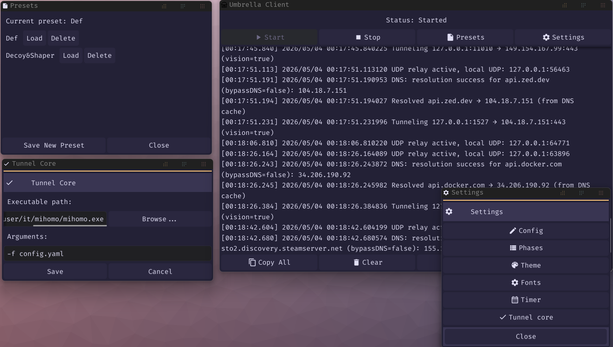

# Umbrella Protocol

SOCKS5 прокси поверх TCP:443 с [Reality](https://github.com/XTLS/REALITY) handshake и yamux мультиплексированием.



---

## Архитектура

```
[Приложение] → SOCKS5 (0.0.0.0:1080)
                    ↓
             [Umbrella клиент]
                    ↓
      TCP:443, TLS ClientHello = Chrome (utls)
      Reality auth в SessionId (ECDH + HKDF + AES-GCM)
      yamux — все SOCKS5 потоки поверх одного TLS-соединения
      Ротация сессии каждые 3–15 минут (crypto/rand)
                    ↓
             [Umbrella сервер]
      xtls/reality — аутентификация в ClientHello,
      неаутентифицированные запросы → fallback (github.com)
      yamux → handleTunnel → целевой хост
                    ↓
             [Целевой сайт]
```

### Уровень 1 — handshake (Reality)

Аутентификация встроена в TLS ClientHello, а не в прикладные данные:

1. Клиент запускает `BuildHandshakeState()` — ClientHello строится в памяти без отправки.
2. Клиент извлекает эфемерный x25519-ключ из KeyShare и вычисляет `sharedSecret = X25519(clientEphPriv, serverStaticPub)`.
3. `authKey = HKDF-SHA256(ikm=sharedSecret, salt=random[:20], info="REALITY")`.
4. Plaintext (16 байт) `[ver=0 | zeros | unix_time(4) | shortId(8)]` шифруется `AES-256-GCM(authKey, nonce=random[20:32])`, результат (32 байта) записывается в поле `SessionId`.
5. `MarshalClientHello()` → `Handshake()`.

Сервер (`xtls/reality`) делает то же самое независимо: если расшифровка `SessionId` валидна — соединение аутентифицировано. Иначе — прозрачный прокси к `dest` (github.com). Сервер никогда не показывает свой собственный сертификат.

### Уровень 1.5 — Umbrella Vision (маскировка TLS-in-TLS)

**Задача.** Когда приложение открывает HTTPS-соединение через туннель, его TLS ClientHello и весь inner handshake проходят в зашифрованном виде через outer Reality TLS. DPI не читает содержимое, но видит **статистический паттерн размеров первых TLS-записей** (inner ClientHello ≈ 300–500 байт, затем характерная последовательность record'ов) — это детектируемый признак TLS-in-TLS.

**Как работает.**

1. Клиент решает использовать Vision динамически, по содержимому трафика: сначала отправляет SOCKS5-ответ об успехе, затем подсматривает (peek) первый байт от приложения. Если первый байт равен `0x16` (TLS Handshake) — открывает Vision-поток (`cmd=0x03`), иначе открывает обычный поток (`cmd=0x00`). Это предотвращает deadlock и корректно пропускает нестандартные протоколы на порту 443 (например, MTProto у Telegram).
2. В фазе Handshake (record types `0x14` CCS, `0x15` Alert, `0x16` Handshake) каждый inner TLS record оборачивается в Vision-фрейм перед отправкой в туннель:
   ```
   [2 bytes: padding_len, random 0..255]
   [padding_len bytes: crypto/rand noise]
   [5 bytes: оригинальный TLS record header]
   [N bytes: оригинальный TLS record body]
   ```
3. Как только встречается первый Application Data record (`0x17`) — клиент отправляет sentinel `[0xFF 0xFF]` и переключается в режим "Splice": чистый `io.Copy` внутри yamux-потока без оверхеда на random-padding. Из-за мультиплексирования (yamux) двойное шифрование (внешний слой Reality TLS) всё равно сохраняется — для DPI это неразличимо, внутренний контент полностью скрыт.

**Отличия от XTLS Vision:**

| Характеристика                      | Классический XTLS-Vision (Xray)                       | Umbrella Vision                                |
| ----------------------------------- | ----------------------------------------------------- | ---------------------------------------------- |
| Детектирование TLS                  | Маршрутизация (жестко через `flow: xtls-rprx-vision`) | Автодетект по первому байту (`peekOneByte`)    |
| Padding                             | Идеально совпадает с размерами Chrome                 | Случайный, per-record (0–255 байт)             |
| Шифрование Application Data         | Снимает внешний слой шифрования (zero-copy splice)    | Оставляет внешнее Reality-шифрование           |
| При прокидывании MTProto (Telegram) | Обрывает соединение (не совпадает с TLS)              | Пропускает через обычный зашифрованный туннель |
| Требует настройки клиента           | Да (`flow`)                                           | Нет, работает прозрачно                        |

---

### Уровень 2 — мультиплексирование (yamux)

Все SOCKS5-потоки идут внутри одного TLS-соединения через yamux. Нет лавины отдельных TLS-handshake'ов при многопоточной загрузке.

### Уровень 3 — ротация сессии

Клиент ротирует TLS-соединение каждые **3–15 минут** случайным образом (`crypto/rand`). Активные потоки yamux дожидаются естественного завершения. Следующий SOCKS5-запрос прозрачно открывает новое соединение с новым handshake.

### Уровень 4 — Shaper

**Задача.** Даже при правильном TLS fingerprint и скрытой аутентификации DPI может детектировать туннель по характеру потока: трафик ограничиваемых ресурсов может быть почти равномерным потоком или всплеск-пауза-всплеск. Shaper позволяет менять форму трафика за счет создания списка рандомно переключаемых фаз (если их больше одной) с ограничением скоростей. Можно определить просто одну фазу (тогда shaper начнет действовать как limiter).

**Как работает**

- При `shaper` клиент запускает локальный **phase engine**.
- Бесконечный цикл случайно выбирает фазу (≠ предыдущей, если кол-во фаз > 1), длительность и применяет лимиты через token-bucket.

**Фазы:**

| Фаза        | Длительность | ↓ Mbps | ↑ Mbps | Что имитирует                      |
| ----------- | ------------ | ------ | ------ | ---------------------------------- |
| `idle`      | 1–2 сек      | 0.0    | 0.0    | Простой                            |
| `page_load` | 1–2 сек      | 12.0   | 0.8    | Загрузка HTML / CSS / JS / шрифтов |
| `images`    | 1–2 сек      | 6.0    | 0.1    | Загрузка галереи / превью          |
| `api_call`  | 1–2 сек      | 0.4    | 0.3    | Короткий XHR / fetch-запрос        |
| `upload`    | 1–2 сек      | 0.3    | 4.0    | Загрузка файла или фото на сервер  |

Детерминированного цикла нет: каждая следующая фаза выбирается случайно (≠ предыдущей, если кол-во фаз > 1), длительность в диапазоне. Паттерн нерегулярен.

**Throttling.** Реализован встроенным token-bucket (без внешних deps). Фаза с 0 Mbps полностью блокирует запись. shapedWriter/shapedReader оборачивают io в throttle.

**Пример.**

Как-то так примерно выглядит общая форма трафика Youtube когда вы смотрите видео (1080p 60fps). Довольно характерный паттерн.


А вот так форму трафика можно поменять с помощью Shaper. Уже больше похоже на скачивание какого-то файла.


### Уровень 5 — Decoy Traffic

**Задача.** Дополнительно скрыть паттерны использования конкретных приложений (например, мессенджеров) и защитить соединение от статистического анализа (IAT — Inter-Arrival Time). Многие приложения могут иметь характерные последовательности и интервалы пакетов, что может анализироваться со стороны DPI. Decoy Traffic создает постоянный «шум» в потоке пакетов, перемешиваясь с реальными пакетами приложений. Засчет этого анализ затрудняется и трафик некоторых приложений может потерять свои характерные паттерны пакетов для DPI.

**Как работает.**

- Клиент запускает фоновую горутину для каждой активной Reality-сессии.
- Горутина генерирует от 1 до 5 случайных HTTP-запросов в секунду к популярным ресурсам (Google, Wikipedia, GitHub и др.).
- Список целевых URL берется из файла `decoy_reqs.json`.
- Каждый запрос открывает новый стрим внутри yamux-сессии.

Это нарушает специфический "ритм" пакетов приложения из-за постоянного "подмешивания" данных от decoy запросов.

---

## Преимущества и недостатки перед Xray (VLESS+REALITY+XTLS)

Оригинальный XTLS нацелен на максимальную производительность (снятие обертки) и строгую маршрутизацию, ради чего жертвует гибкостью. Umbrella использует другой подход, ориентируясь на отсутствие конфигурации и безотказность.

**Преимущества Umbrella:**

1. **Ничего не ломает (Универсальность):** Ваш клиент сначала читает первый байт соединения от SOCKS5-приложения. Если это TLS — применяется Vision. Если это сырой MTProto (Telegram) или проприетарный трафик игры — он просто заворачивается в обычный зашифрованный туннель. Клиенту Xray с `xtls-rprx-vision` потребовались бы сложные правила маршрутизации, иначе не-TLS трафик на настроенном порту обрывался бы для защиты от детектирования (active probing).
2. **Нулевая настройка (Zero-config):** Администратору или пользователю не нужно думать о директивах `flow`. Протокол подстраивается сам для каждого нового потока на лету.
3. **Безопасность мультиплексирования:** Через единый внешний TCP-туннель (Reality) внутри `yamux` проходят сотни внутренних SOCKS5-запросов. DPI никогда не узнает количество открытых подключений. В оригинальном Xray каждый сплайсированный поток порождает отдельное внешнее подключение.
4. **Shaper:** Может использоваться чтобы создать непредсказуемый паттерн трафика или просто сильно изменить существующий, тем самым затруднив для DPI статистический анализ.
5. **Decoy Traffic:** Позволяет разбавлять полезный трафик (например, мессенджеров) постоянным потоком HTTP-запросов к популярным сайтам. Это скрывает характерные интервалы между пакетами (IAT) и "ломает" характерные паттерны приложений.

**Недостатки Umbrella:**

1. **Оверхед процессора (Двойное шифрование):** Xray XTLS делает "сплайсинг" — отключает слой VLESS на стадии Application Data и отправляет внутренний трафик наружу "как есть" (поскольку он уже зашифрован внутренним HTTPS). Из-за `yamux` Umbrella вынуждена всегда шифровать трафик вторым слоем (внешним сервером Reality). Это создает небольшую (1-2%) лишнюю нагрузку на процессор VPS/клиента, что может быть заметно на гигабитных скоростях роутеров, но незаметно в повседневном использовании.
2. **Дополнительная задержка на старте:** Чтение первого байта (`peekOneByte`) в юзерспейс перед принятием решения о типе потока добавляет микросекундную задержку по сравнению со слепой маршрутизацией прямо в ядро у Xray.

---

## Umbrella Server

Серверная часть. Конфигурация через `config.yaml`.

```bash
./umbrella-server --config config.yaml

```

Файл `config.yaml` создается автоматически с настройками по умолчанию. При первом запуске сервер выведет в лог сгенерированные `Generated private key`, `Public key` и `Short ID` — их нужно записать. `Public key` и `Short ID` используются в клиенте. `Generated private key` и `Short ID` добавляются в конфиг сервера чтобы вместо генерации новых он использовал их при перезапуске.

| Поле           | По умолчанию       | Описание                                         |
| -------------- | ------------------ | ------------------------------------------------ |
| `port`         | `443`              | Порт для входящих соединений                     |
| `private-key`  | генерируется       | x25519 приватный ключ, base64 (32 байта)         |
| `short-id`     | генерируется       | Reality Short ID, hex до 16 символов             |
| `dest`         | `github.com:443`   | Fallback сайт для неаутентифицированных запросов |
| `server-names` | hostname из `dest` | Допустимые SNI через запятую                     |

---

## Umbrella Client

Графический клиент на базе [Fyne](https://fyne.io/). Расположен в директории `umbrella_client`.

### Основные возможности
- **Встроенный SOCKS5-proxy клиент**: запуск/остановка туннеля с визуализацией логов
- **Редактирование конфигов**: редактирование `config.yaml` и `phases.yml` через встроенный редактор
- **Presets**: сохранение и загрузка нескольких конфигураций
- **Timer**: автоматическая остановка через N минут
- **Темы**: несколько предустановленных тем с возможностью выбора
- **Шрифты**: установка и выбор UI-шрифтов (поддержка `.ttf` и `.otf`)
- **Tunnel Core**: интеграция со сторонними туннельными инструментами ([Mihomo](https://wiki.metacubex.one), [sing-box](https://sing-box.sagernet.org/), [ProxiFyre](https://github.com/wiresock/proxifyre))
- **DNS**: встроенный локальный DNS-сервер (dnsmasq-подобный) с кэшированием IP→hostname для корректной работы bypass
- **Bypass**: список доменов (с поддоменами) и IP-подсетей (CIDR) для прямого подключения, минуя туннель

### Интерфейс
- Кнопки **Start/Stop** — запуск и остановка клиента
- Кнопка **Timer** — настройка автоостановки
- Кнопка **Settings** — меню настроек (Config, Phases, Theme, Fonts, Presets, Tunnel Core)
- Кнопки **A-/A+** — уменьшение/увеличение размера шрифта логов
- **Copy All** — копирование всех логов в буфер обмена
- **Clear** — очистка логов

### Параметры (config.yaml)

| Поле                      | По умолчанию   | Описание                                                                                     |
| ------------------------- | -------------- | -------------------------------------------------------------------------------------------- |
| `server`                  | обязателен     | Адрес сервера `host:port`                                                                    |
| `public-key`              | обязателен     | x25519 публичный ключ сервера, base64                                                        |
| `short-id`                | обязателен     | Reality Short ID, hex                                                                        |
| `sni`                     | `github.com`   | SNI в TLS ClientHello                                                                        |
| `listen`                  | `0.0.0.0:1080` | Локальный SOCKS5 адрес                                                                       |
| `udp`                     | `true`         | Включить UDP ASSOCIATE; `false` = только TCP                                                 |
| `close-on-rotate`         | `false`        | Закрывать активные соединения при ротации сессии                                             |
| `shaper`                  | `false`        | Включить Shaper — поведенческий shaping трафика                                              |
| `phases-file`             | `phases.yml`   | Путь к YAML-файлу с фазами shaping'а                                                         |
| `decoy-traffic`           | `false`        | Включить генерацию фонового трафика                                                          |
| `connections-time-out`    | `300`          | Тайм-аут бездействия в секундах                                                              |
| `sessions-num`            | `5`            | Количество сессий yamux в пуле                                                               |
| `dns-listen`              | `""`           | Адрес локального DNS-сервера (например, `127.0.0.1:53`)                                      |
| `dns-upstream`            | `8.8.8.8:53`   | Вышестоящий DNS-сервер (запросы к нему идут через туннель)                                   |
| `dns-upstream-for-bypass` | `""`           | Опциональный DNS-сервер для доменов из `bypass` (запросы к нему идут напрямую, мимо туннеля) |
| `bypass`                  | `[]`           | Список доменов (включая поддомены) или IP подсетей (CIDR) для прямого подключения            |

- **Включение `close-on-rotate` может оборвать загрузку данных, если она не была закончена в момент ротации**

- **Включение `shaper` может тормозить download и upload**

- **Уменьшение `connections-time-out` может заставлять приложения чаще отправлять свои запросы на соединение с сервером**

- **Уменьшение `sessions-num` может уменьшить общую скорость трафика**

- **Включение `decoy-traffic` увеличит общее потребление трафика (особенно при базовом --sessions-num = 5). Рекомендуется выставить `sessions-num` в значение `1` или `2` и следить за потреблением трафика, если на него есть лимиты**

---

## Использование

### Windows
Относительно просто
- Можно запустить как обычной socks сервер и подключать к нему приложения через настройки или расширение браузера. 
- Можно скачать одно из средств туннелирования отмеченных выше, в папке с ним настроить для него конфиг, указать в настройках `Tunnel core` клиента путь к нему. Umbrella client будет сам включать и выключать его между запусками.

**Лучше запускать от имени администратора. При использовании `Tunnel core` это обязательно**

### Android
Тут будет немного сложно. Само приложение устанавливается и работает, но поскольку у `fyne` [нет интеграции со специальным android сервисом](https://github.com/fyne-io/fyne/discussions/5221), приложение не будет корректно работать в фоне и при выключенном экране, если ничего не сделать. Если предпринять шаги описанные в [этой инструкции](./android_fix.md), то приложение начнет нормально жить и работать. **Но стабильность все равно не гарантирована.**

---

## Сборка

Требуется Go 1.25+.

### Umbrella Server (Linux)

```bash
cd umbrella_server
$env:GOOS="linux"; $env:GOARCH="amd64"; go build -o cd umbrella_server .
```

### Umbrella Client

#### Windows

```bash
cd umbrella_client/cmd/ui
go build -ldflags="-H=windowsgui" -o umbrella-client.exe
```

#### Android

Требуется Docker и установленный [`fyne-cross`](https://github.com/fyne-io/fyne-cross).

```bash
cd umbrella_client
fyne-cross android -app-id com.umbrella.client ./cmd/ui
```
