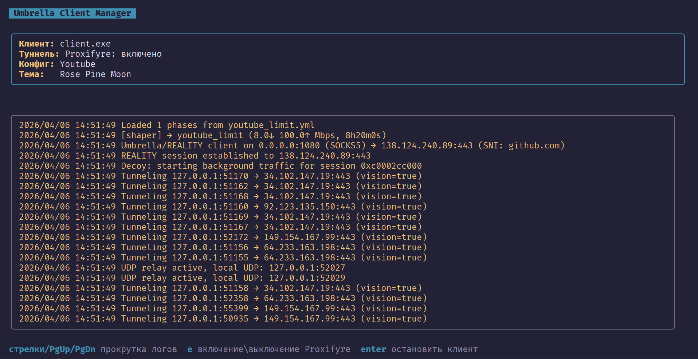

# Umbrella Protocol

SOCKS5 прокси поверх TCP:443 с [Reality](https://github.com/XTLS/REALITY) handshake и yamux мультиплексированием.



---

## Архитектура

```
[Приложение] → SOCKS5 (0.0.0.0:1080)
                    ↓
             [Umbrella клиент]
                    ↓
      TCP:443, TLS ClientHello = Chrome (utls)
      Reality auth в SessionId (ECDH + HKDF + AES-GCM)
      yamux — все SOCKS5 потоки поверх одного TLS-соединения
      Ротация сессии каждые 3–15 минут (crypto/rand)
                    ↓
             [Umbrella сервер]
      xtls/reality — аутентификация в ClientHello,
      неаутентифицированные запросы → fallback (cloudflare.com)
      yamux → handleTunnel → целевой хост
                    ↓
             [Целевой сайт]
```

### Уровень 1 — handshake (Reality)

Аутентификация встроена в TLS ClientHello, а не в прикладные данные:

1. Клиент запускает `BuildHandshakeState()` — ClientHello строится в памяти без отправки.
2. Клиент извлекает эфемерный x25519-ключ из KeyShare и вычисляет `sharedSecret = X25519(clientEphPriv, serverStaticPub)`.
3. `authKey = HKDF-SHA256(ikm=sharedSecret, salt=random[:20], info="REALITY")`.
4. Plaintext (16 байт) `[ver=0 | zeros | unix_time(4) | shortId(8)]` шифруется `AES-256-GCM(authKey, nonce=random[20:32])`, результат (32 байта) записывается в поле `SessionId`.
5. `MarshalClientHello()` → `Handshake()`.

Сервер (`xtls/reality`) делает то же самое независимо: если расшифровка `SessionId` валидна — соединение аутентифицировано. Иначе — прозрачный прокси к `--dest` (cloudflare.com). Сервер никогда не показывает свой собственный сертификат.

### Уровень 1.5 — Umbrella Vision (маскировка TLS-in-TLS)

**Задача.** Когда приложение открывает HTTPS-соединение через туннель, его TLS ClientHello и весь inner handshake проходят в зашифрованном виде через outer Reality TLS. DPI не читает содержимое, но видит **статистический паттерн размеров первых TLS-записей** (inner ClientHello ≈ 300–500 байт, затем характерная последовательность record'ов) — это детектируемый признак TLS-in-TLS.

**Как работает.**

1. Клиент решает использовать Vision динамически, по содержимому трафика: сначала отправляет SOCKS5-ответ об успехе, затем подсматривает (peek) первый байт от приложения. Если первый байт равен `0x16` (TLS Handshake) — открывает Vision-поток (`cmd=0x03`), иначе открывает обычный поток (`cmd=0x00`). Это предотвращает deadlock и корректно пропускает нестандартные протоколы на порту 443 (например, MTProto у Telegram).
2. В фазе Handshake (record types `0x14` CCS, `0x15` Alert, `0x16` Handshake) каждый inner TLS record оборачивается в Vision-фрейм перед отправкой в туннель:
   ```
   [2 bytes: padding_len, random 0..255]
   [padding_len bytes: crypto/rand noise]
   [5 bytes: оригинальный TLS record header]
   [N bytes: оригинальный TLS record body]
   ```
3. Как только встречается первый Application Data record (`0x17`) — клиент отправляет sentinel `[0xFF 0xFF]` и переключается в режим "Splice": чистый `io.Copy` внутри yamux-потока без оверхеда на random-padding. Из-за мультиплексирования (yamux) двойное шифрование (внешний слой Reality TLS) всё равно сохраняется — для DPI это неразличимо, внутренний контент полностью скрыт.

**Отличия от XTLS Vision:**

| Характеристика                      | Классический XTLS-Vision (Xray)                       | Umbrella Vision                                |
|-------------------------------------|-------------------------------------------------------|------------------------------------------------|
| Детектирование TLS                  | Маршрутизация (жестко через `flow: xtls-rprx-vision`) | Автодетект по первому байту (`peekOneByte`)    |
| Padding                             | Идеально совпадает с размерами Chrome                 | Случайный, per-record (0–255 байт)             |
| Шифрование Application Data         | Снимает внешний слой шифрования (zero-copy splice)    | Оставляет внешнее Reality-шифрование           |
| При прокидывании MTProto (Telegram) | Обрывает соединение (не совпадает с TLS)              | Пропускает через обычный зашифрованный туннель |
| Требует настройки клиента           | Да (`flow`)                                           | Нет, работает прозрачно                        |

---

### Уровень 2 — мультиплексирование (yamux)

Все SOCKS5-потоки идут внутри одного TLS-соединения через yamux. Нет лавины отдельных TLS-handshake'ов при многопоточной загрузке.

### Уровень 3 — ротация сессии

Клиент ротирует TLS-соединение каждые **3–15 минут** случайным образом (`crypto/rand`). Активные потоки yamux дожидаются естественного завершения. Следующий SOCKS5-запрос прозрачно открывает новое соединение с новым handshake.

### Уровень 4 — Shaper (поведенческий shaping трафика)

**Задача.** Даже при правильном TLS fingerprint и скрытой аутентификации DPI может детектировать туннель по характеру потока: трафик ограничиваемых ресурсов может быть почти равномерным потоком или всплеск-пауза-всплеск. Shaper позволяет менять форму трафика за счет создания списка рандомно переключаемых фаз (если их больше одной) с ограничением скоростей. Можно определить просто одну фазу (тогда shaper начнет действовать как limiter).

**Как работает**

- При `--shaper` клиент запускает локальный **phase engine**.
- Бесконечный цикл случайно выбирает фазу (≠ предыдущей, если кол-во фаз > 1), длительность и применяет лимиты через token-bucket.
- Между фазами — случайная пауза 1–10 сек (fallback to no throttle).

**Фазы:** (настраиваются в файле, указанном через `--phases-file` (по умолчанию `phases.yml`))

| Фаза        | Длительность | ↓ Mbps | ↑ Mbps | Что имитирует                      |
|-------------|--------------|--------|--------|------------------------------------|
| `idle`      | 1–2 сек      | 0.0    | 0.0    | Простой                            |
| `page_load` | 1–5 сек      | 12.0   | 0.8    | Загрузка HTML / CSS / JS / шрифтов |
| `images`    | 1–5 сек      | 6.0    | 0.1    | Загрузка галереи / превью          |
| `api_call`  | 1–2 сек      | 0.4    | 0.3    | Короткий XHR / fetch-запрос        |
| `upload`    | 1–5 сек      | 0.3    | 4.0    | Загрузка файла или фото на сервер  |

Детерминированного цикла нет: каждая следующая фаза выбирается случайно (≠ предыдущей, если кол-во фаз > 1), длительность в диапазоне. Паттерн нерегулярен.

**Throttling.** Реализован встроенным token-bucket (без внешних deps). Фаза с 0 Mbps полностью блокирует запись. shapedWriter/shapedReader оборачивают io в throttle.

### Уровень 5 — Decoy Traffic (фоновый «шумовой» трафик)

**Задача.** Дополнительно скрыть паттерны использования конкретных приложений (например, мессенджеров) и защитить соединение от статистического анализа (IAT — Inter-Arrival Time). Многие приложения могут иметь характерные последовательности и интервалы пакетов, что может анализироваться со стороны DPI. Decoy Traffic создает постоянный «шум» в потоке пакетов, перемешиваясь с реальными пакетами приложений. Засчет этого анализ затрудняется и трафик некоторых приложений может просто "утонуть" на фоне «шума» и стать неразличимым.

**Как работает.**

- При использовании флага `--decoy-traffic` клиент запускает фоновую горутину для каждой активной Reality-сессии.
- Горутина генерирует от 1 до 5 случайных HTTP-запросов в секунду к популярным ресурсам (Google, Wikipedia, GitHub и др.).
- Список целевых URL берется из файла `decoy_reqs.json`.
- Каждый запрос открывает новый стрим внутри yamux-сессии, имитируя обычный веб-серфинг.

Это превращает специфический ритм пакетов приложения в хаотичный поток данных, который для внешнего наблюдателя выглядит как активная работа пользователя в браузере.

---

## Преимущества и недостатки перед Xray (VLESS+REALITY+XTLS)

Оригинальный XTLS нацелен на максимальную производительность (снятие обертки) и строгую маршрутизацию, ради чего жертвует гибкостью. Umbrella использует другой подход, ориентируясь на отсутствие конфигурации и безотказность.

**Преимущества Umbrella:**

1. **Ничего не ломает (Универсальность):** Ваш клиент сначала читает первый байт соединения от SOCKS5-приложения. Если это TLS — применяется Vision. Если это сырой MTProto (Telegram) или проприетарный трафик игры — он просто заворачивается в обычный зашифрованный туннель. Клиенту Xray с `xtls-rprx-vision` потребовались бы сложные правила маршрутизации, иначе не-TLS трафик на настроенном порту обрывался бы для защиты от детектирования (active probing).
2. **Нулевая настройка (Zero-config):** Администратору или пользователю не нужно думать о директивах `flow`. Протокол подстраивается сам для каждого нового потока на лету.
3. **Безопасность мультиплексирования:** Через единый внешний TCP-туннель (Reality) внутри `yamux` проходят сотни внутренних SOCKS5-запросов. DPI никогда не узнает количество открытых подключений. В оригинальном Xray каждый сплайсированный поток порождает отдельное внешнее подключение.
4. **Shaper трафика:** Может использоваться чтобы создать непредсказуемый паттерн трафика или просто сильно изменить существующий, тем самым затруднив для DPI статистический анализ.
5. **Decoy Traffic (Фоновый шум):** Позволяет разбавлять полезный трафик (например, мессенджеров) постоянным потоком HTTP-запросов к популярным сайтам. Это скрывает характерные интервалы между пакетами (IAT) и делает активность туннеля неотличимой от обычного веб-серфинга в браузере.

**Недостатки Umbrella:**

1. **Оверхед процессора (Двойное шифрование):** Xray XTLS делает "сплайсинг" — отключает слой VLESS на стадии Application Data и отправляет внутренний трафик наружу "как есть" (поскольку он уже зашифрован внутренним HTTPS). Из-за `yamux` Umbrella вынуждена всегда шифровать трафик вторым слоем (внешним сервером Reality). Это создает небольшую (1-2%) лишнюю нагрузку на процессор VPS/клиента, что может быть заметно на гигабитных скоростях роутеров, но незаметно в повседневном использовании.
2. **Дополнительная задержка на старте:** Чтение первого байта (`peekOneByte`) в юзерспейс перед принятием решения о типе потока добавляет микросекундную задержку по сравнению со слепой маршрутизацией прямо в ядро у Xray.

---

## Сборка

Требуется Go 1.25+.

```bash
# Сервер (под Linux)
cd umbrella-protocol/server
$env:GOOS="linux" $env:GOARCH="amd64" go build -o server .

# Клиент
cd umbrella-protocol/client
go build -o client .

# Клиент для андроид
cd umbrella-protocol/client
$env:GOOS="android"; $env:GOARCH="arm64"; go build -o client .
```

---

## Запуск

### Сервер (VPS)

```bash
# Первый запуск — сгенерировать ключи (сервер выведет их в лог):
./umbrella-server --port 443 --dest cloudflare.com:443

# Из лога запишите:
#   Public key (use as client --public-key): <base64>
#   Short ID (use as client --short-id):     <hex>

# Повторный запуск с сохранёнными ключами:
./umbrella-server \
  --port 443 \
  --private-key <base64_private_key> \
  --short-id <hex_short_id> \
  --dest cloudflare.com:443 \
  --server-names cloudflare.com
```

Флаги сервера:

| Флаг             | По умолчанию         | Описание                                         |
|------------------|----------------------|--------------------------------------------------|
| `--port`         | `443`                | Порт для входящих соединений                     |
| `--private-key`  | генерируется         | x25519 приватный ключ, base64 (32 байта)         |
| `--short-id`     | генерируется         | Reality Short ID, hex до 16 символов             |
| `--dest`         | `cloudflare.com:443` | Fallback сайт для неаутентифицированных запросов |
| `--server-names` | hostname из `--dest` | Допустимые SNI через запятую                     |

### Клиент

```bash
./umbrella-client \
  --server vps.example.com:443 \
  --public-key <base64_public_key> \
  --short-id <hex_short_id> \
  --sni cloudflare.com \
  --listen 0.0.0.0:1080
```

Флаги клиента:

| Флаг                     | По умолчанию                        | Описание                                                                                                                                                                     |
|--------------------------|-------------------------------------|------------------------------------------------------------------------------------------------------------------------------------------------------------------------------|
| `--server`               | обязателен                          | Адрес сервера `host:port`                                                                                                                                                    |
| `--public-key`           | обязателен                          | x25519 публичный ключ сервера, base64                                                                                                                                        |
| `--short-id`             | обязателен                          | Reality Short ID, hex                                                                                                                                                        |
| `--sni`                  | `cloudflare.com`                    | SNI в TLS ClientHello                                                                                                                                                        |
| `--listen`               | `0.0.0.0:1080`                      | Локальный SOCKS5 адрес                                                                                                                                                       |
| `--udp`                  | `true`                              | Включить UDP ASSOCIATE; `false` = только TCP                                                                                                                                 |
| `--close-on-rotate`      | `false`                             | Закрывать активные соединения при ротации сессии; `false` — оставить их до естественного завершения                                                                          |
| `--shaper`               | `false`                             | Включить Shaper — поведенческий shaping трафика (token-bucket + локальный phase engine на клиенте)                                                                           |
| `--phases-file`          | `phases.yml`                        | Путь к YAML-файлу с фазами shaping'а трафика                                                                                                                                 |
| `--decoy-traffic`        | Включить генерацию фонового трафика | `false`                                                                                                                                                                      |
| `--connections-time-out` | `300`                               | Закрывать соединения если не отвечают более указанного числа секунд (0 — отключить). Может помочь если DPI специально замораживает соединения вместо того чтобы их обрывать. |
| `--sessions-num`         | `5`                                 | Количество сессий yamux в пуле.                                                                                                                                              |

- **Включение `--close-on-rotate` может оборвать загрузку данных, если она не была закончена в момент ротации**

- **Включение `--shaper` может тормозить download и upload**

- **Уменьшение `--connections-time-out` может заставлять приложения чаще отправлять свои запросы на соединение с сервером**

- **Уменьшение `--sessions-num` может уменьшить общую скорость трафика**

- **Включение `--decoy-traffic` увеличит общее потребление трафика (особенно при базовом --sessions-num = 5). Рекомендуется выставить `--sessions-num` в значение `1` или `2` и следить за потреблением трафика, если на него есть лимиты**

---

## Umbrella Client Manager

Для удобного управления конфигурациями и запуска клиента доступен **Umbrella Client Manager**. Он предоставляет текстовый графический интерфейс (TUI) на базе [Bubble Tea](https://github.com/charmbracelet/bubbletea).

### Основные возможности
- **Управление профилями**: Создание, редактирование и удаление различных конфигураций запуска (разные серверы, ключи, наборы флагов).
- **Интерактивный интерфейс**: Навигация стрелками, поддержка горячих клавиш и цветовые темы (Catppuccin, Rose Pine).
- **Просмотр логов в реальном времени**: Отдельное окно для вывода логов клиента с поддержкой прокрутки (`PgUp`/`PgDn`) и автопрокруткой.
- **Информационная панель**: Всегда актуальные данные о пути к клиенту, активном конфиге и выбранной теме в верхней части экрана.
- **Автоматизация**: Сохранение всех настроек в `settings.json` для мгновенного запуска при следующем сеансе.

### Горячие клавиши
- **Главное меню**:
  - `r` — запустить клиент с активной конфигурацией.
  - `s` — перейти в меню настройки конфигураций.
  - `t` — открыть меню выбора цветовых тем.
  - `q` — выход из менеджера.
- **Меню настроек**:
  - `enter` — выбрать наведенную конфигурацию как активную.
  - `c` — создать новый профиль.
  - `d` — удалить выбранный профиль.
  - `b` / `esc` — вернуться в главное меню.
- **Окно логов**:
  - `стрелки` / `PgUp` / `PgDn` — прокрутка истории логов.
  - `enter` — остановить клиент и вернуться в меню.

### Сборка и запуск
Менеджер находится в директории `client_manager`.

```bash
cd umbrella-protocol/client_manager
go build -o manager .
./manager

# Для Android
cd umbrella-protocol/client_manager
$env:GOOS="android"; $env:GOARCH="arm64"; go build -o manager .
```

---

## Как использовать (пока однокнопочного варианта нет)

- Для Windows использую в связке с `Clash Verge` в режиме `TUN`. В правилах надо создать socks5 proxy на `0.0.0.0:1080` без аутентфикации.

- На Android использую связку `ReTerminal` + `Clash Meta`. `ReTerminal` нужен для запуска клиента\менеджера. В `Clash Meta` прокидывается конфиг файл такой же как для `Clash Verge`. Если сматрфон и пк в одной локальной сети (например дома по одному wifi), то можно просто приконнектить смартфон к пк с помощью любого socks5 клиента указав локальный ip пк.
