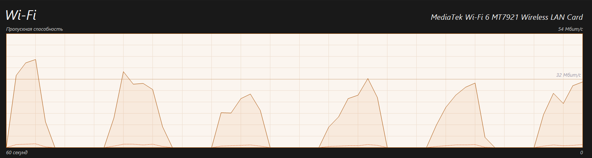
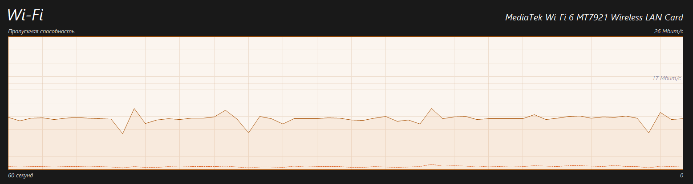

# Shaper

**Задача.** Даже при правильном TLS fingerprint и скрытой аутентификации DPI может детектировать туннель по характеру потока: трафик ограничиваемых ресурсов может быть почти равномерным потоком или всплеск-пауза-всплеск. Shaper позволяет менять форму трафика за счет создания списка рандомно переключаемых фаз (если их больше одной) с ограничением скоростей. Можно определить просто одну фазу (тогда shaper начнет действовать как limiter).

**Как работает**

- При `shaper` клиент запускает локальный **phase engine**.
- Бесконечный цикл случайно выбирает фазу (≠ предыдущей, если кол-во фаз > 1), длительность и применяет лимиты через token-bucket.

**Фазы:**

| Фаза        | Длительность | ↓ Mbps | ↑ Mbps | Что имитирует                      |
| ----------- | ------------ | ------ | ------ | ---------------------------------- |
| `idle`      | 1–2 сек      | 0.0    | 0.0    | Простой                            |
| `page_load` | 1–2 сек      | 12.0   | 0.8    | Загрузка HTML / CSS / JS / шрифтов |
| `images`    | 1–2 сек      | 6.0    | 0.1    | Загрузка галереи / превью          |
| `api_call`  | 1–2 сек      | 0.4    | 0.3    | Короткий XHR / fetch-запрос        |
| `upload`    | 1–2 сек      | 0.3    | 4.0    | Загрузка файла или фото на сервер  |

Детерминированного цикла нет: каждая следующая фаза выбирается случайно (≠ предыдущей, если кол-во фаз > 1), длительность в диапазоне. Паттерн нерегулярен.

**Throttling.** Реализован встроенным token-bucket (без внешних deps). Фаза с 0 Mbps полностью блокирует запись. shapedWriter/shapedReader оборачивают io в throttle.

**Пример.**

Как-то так примерно выглядит общая форма трафика Youtube когда вы смотрите видео (1080p 60fps). Довольно характерный паттерн.

А вот так форму трафика можно поменять с помощью Shaper. Уже больше похоже на скачивание какого-то файла.

